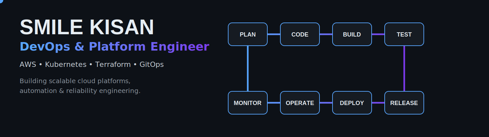

# Smile Kisan

### DevOps & Platform Engineer

Building cloud-native infrastructure, automation systems, and reliable platforms.

**AWS • Kubernetes • Terraform • GitOps • Observability**

---

---

<table>
<tr>
<td width="33%">

### ☁️ Cloud
AWS
 Docker
 Linux
 Networking

</td>
<td width="33%">

### ⚙️ Platform
Kubernetes
 GitOps
 Helm
 EKS

</td>
<td width="33%">

### 🚀 Automation
Terraform
 GitHub Actions
 Ansible
 CI/CD

</td>
</tr>
</table>

---

<table>
<tr>
<td width="50%">

### Background

MSc Advanced Computer Science

Cloud Infrastructure

Platform Engineering

DevOps Automation

</td>
<td width="50%">

### Core Interests

Observability

Cloud Security

SRE

Distributed Systems

</td>
</tr>
</table>

---

**Infrastructure • Automation • Reliability**

